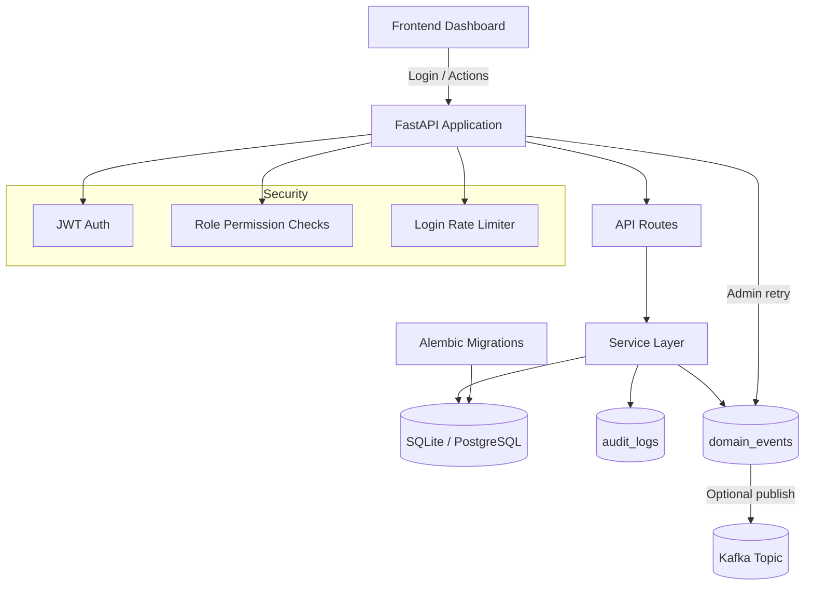

# Finance Data Processing and Access Control Backend

Production-minded assessment project that demonstrates secure finance record management, role-based access control, and operational traceability end to end.

## Project Summary

This project was built to solve three practical backend problems:

1. Enforce who can access or modify financial data.
2. Provide reliable record lifecycle operations (create/read/update/delete/restore).
3. Make system behavior observable through audits, analytics, and event tracking.

It includes a FastAPI backend, SQLAlchemy + Alembic data layer, JWT auth with RBAC, and a lightweight frontend dashboard served by the same app.

## What We Implemented and Why It Helped

| What We Implemented | Why It Helped |
|---|---|
| JWT auth with access + refresh tokens | Improved session security and allowed controlled token renewal |
| RBAC with viewer/analyst/admin roles | Prevented unauthorized record or user operations |
| Record CRUD with soft delete + restore | Preserved data history while enabling safe rollback of deletes |
| Filter/search/pagination on records | Made data retrieval scalable and evaluator-friendly |
| Dashboard summary APIs with trends | Provided quick business insight (income, expense, net, activity) |
| Audit logs for mutations | Added traceability of who changed what and when |
| Outbox-based domain events + retry | Reduced event loss risk and improved reliability under broker failures |
| Login rate limiting | Reduced brute-force login risk |
| Migration-managed schema lifecycle | Kept DB changes reproducible across local/deploy environments |
| Admin operations panel (audits/events) | Improved operational visibility during demos and debugging |

## High-Impact Features

- Secure authentication and authorization boundaries
- Soft-delete lifecycle for financial records
- 6-month trend analytics with zero-filled missing months
- Structured audit and event observability
- Admin-only event retry controls
- Deployment-ready artifacts for Docker and Render

## Architecture Diagram (Mermaid)



## Tech Stack

- FastAPI
- SQLAlchemy ORM
- Alembic
- SQLite (local default) / PostgreSQL (deployment)
- JWT (python-jose)
- Vanilla JS frontend + SVG chart rendering
- Pytest

## Roles and Access Matrix

- viewer: `dashboard:read`
- analyst: `dashboard:read`, `records:read`
- admin: full records management, user management, audit/events access

## API Highlights

- `POST /auth/login` (rate limited)
- `POST /auth/refresh`
- `GET /auth/me`
- `GET /dashboard/summary`
- `GET /records` (supports `q`, filters, `skip`, `limit`, optional `include_deleted` for admin)
- `POST /records`, `PUT /records/{id}`, `DELETE /records/{id}`
- `POST /records/{id}/restore`
- `POST /users`, `GET /users`, `PATCH /users/{id}/status`, `PATCH /users/{id}/role`
- `GET /audits` (filtered, paginated)
- `GET /events`, `POST /events/retry` (admin)

## Local Setup

1. Create and activate virtual environment

```bash
python -m venv .venv
. .venv/Scripts/activate
```

2. Install dependencies

```bash
pip install -r requirements.txt
```

3. Create environment file

```bash
copy .env.example .env
```

4. Seed data and run migrations

```bash
python scripts/seed_data.py
```

5. Start application (port 8001)

```bash
python app/main.py
```

6. Open

- Frontend: http://127.0.0.1:8001/
- API Docs: http://127.0.0.1:8001/docs
- Health: http://127.0.0.1:8001/health

## Demo Credentials

- admin@finance.example.com / Admin@123
- analyst@finance.example.com / Analyst@123
- viewer@finance.example.com / Viewer@123

## Testing

```bash
pytest -q
```

Coverage areas include RBAC, dashboard summary, records search/soft-delete/restore, audits/events permissions, refresh flow, and rate limiting.

## Database Migration Commands

```bash
alembic upgrade head
alembic downgrade -1
```

## Deployment Readiness

Included artifacts:

- `Dockerfile`
- `.dockerignore`
- `render.yaml`
- `Procfile`

### Render Deployment (Example)

1. Create a new web service from this repository.
2. Let Render read `render.yaml`.
3. Set environment variables:
   - `JWT_SECRET_KEY`
   - `DATABASE_URL` (PostgreSQL)
4. Deploy.

## Project Structure Reference

- `app/api/routes`: endpoint handlers
- `app/services`: business logic (records, dashboard, audits, events)
- `app/models`: SQLAlchemy entities
- `app/schemas`: request/response contracts
- `alembic/versions`: migration history
- `frontend/`: static dashboard UI
- `tests/`: API behavior and security coverage

## Assumptions and Tradeoffs

- Single-tenant scope for assessment clarity.
- One-currency model.
- No external payment gateway integration.
- In-memory rate limiter is suitable for single-instance demo; Redis/distributed limiters are preferred for scale.
- Outbox pattern improves resilience, but high-scale production should move publishing to a background worker.

## Additional Documentation

- Architecture notes: `docs/architecture.md`
- ADR: `docs/adr-001-backend-architecture.md`
- Demo script: `docs/demo-script.md`
- API walkthrough helper: `scripts/demo_flow.py`
