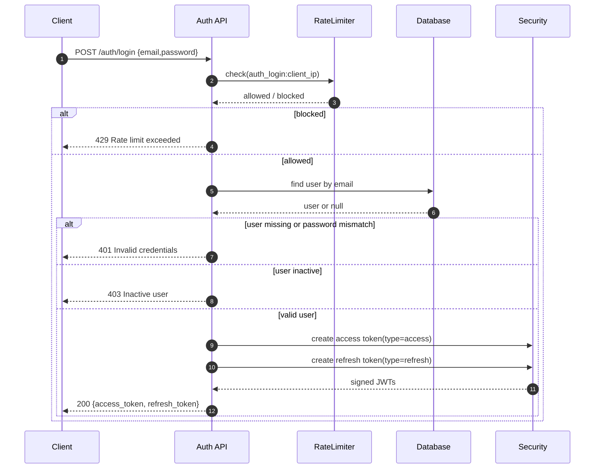
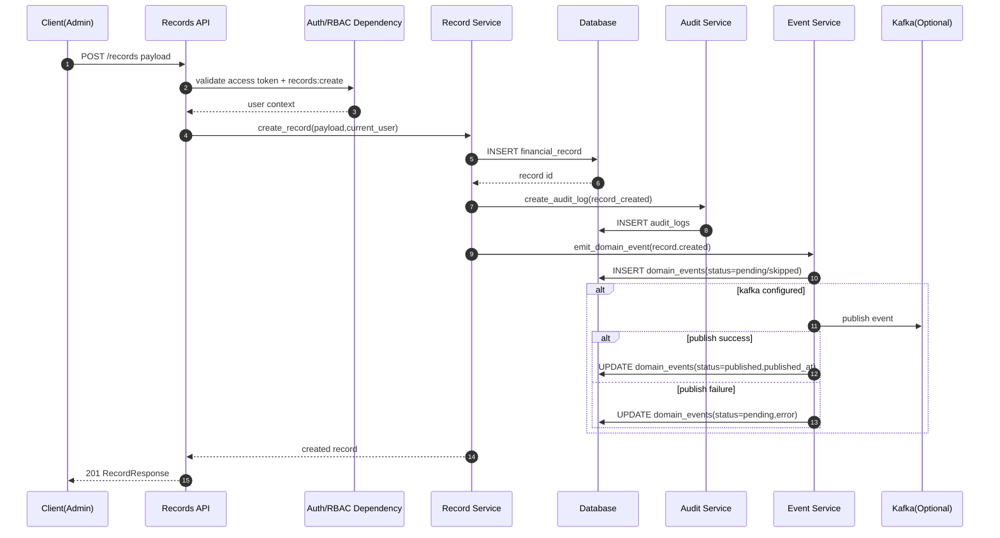
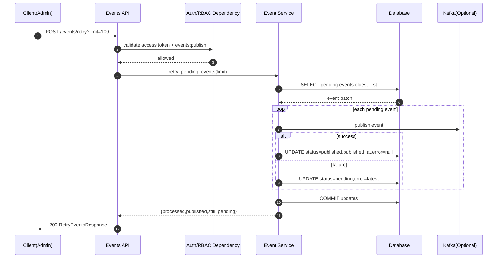

# Study Notes: Finance Data Processing and Access Control Backend

This document explains the project implementation in depth.
It is written so you can use it for revision, interview preparation, project defense, and evaluator walkthrough.

## 1) Project Goal and Scope

The project solves three core problems:

1. Secure access to finance data by role.
2. Reliable data operations for financial records (create, read, update, delete, restore).
3. Operational visibility through audits, dashboard summaries, and event outbox tracking.

The system has a FastAPI backend, SQLAlchemy ORM models, Alembic migrations, and a static frontend served by FastAPI.

## 2) Architecture Overview

### 2.1 Layered Structure

The backend follows this shape:

- API layer: validates requests, performs permission checks, maps to schemas.
- Service layer: executes business logic and side effects (audit logs + domain events).
- Data layer: SQLAlchemy models mapped to relational tables.
- Migration layer: Alembic manages schema evolution.

Typical flow:

1. HTTP request hits route function.
2. Dependency injection resolves DB session + authenticated user.
3. Permission gate validates role action.
4. Service performs DB operations.
5. Service writes audit and event records for mutation operations.
6. Route returns typed response schema.

### 2.2 Runtime Entry

Main runtime behavior:

- App starts from `app/main.py`.
- Frontend static files are mounted at `/frontend`.
- Startup hook runs migrations automatically when enabled.
- `/` serves frontend landing/dashboard page.
- API routers are registered (`auth`, `users`, `records`, `dashboard`, `audits`, `events`).

## 3) Feature-by-Feature Implementation

## 3.1 Authentication (Login + Refresh + Current User)

### What is implemented

- `POST /auth/login`
- `POST /auth/refresh`
- `GET /auth/me`

### How it works

Login flow:

1. Client sends email + password.
2. Route applies rate-limit dependency.
3. User is loaded by email.
4. Password is verified using PBKDF2 hash check.
5. Inactive users are rejected.
6. Access token and refresh token are generated.
7. Response returns both tokens and token type.

Refresh flow:

1. Client sends refresh token.
2. Token is decoded and must contain `type=refresh`.
3. Associated user must still exist and be active.
4. New access + refresh tokens are issued.

Current user flow:

1. Access token is extracted from Bearer header.
2. Token must decode successfully and have `type=access`.
3. User is loaded by token subject (email).
4. User must be active.

### Security details

- Password hashes use salted PBKDF2-SHA256, not plain text.
- Tokens include expiry and token type claim.
- Access token cannot be used where refresh token is required.

## 3.2 RBAC Permission System

### What is implemented

Three roles:

- viewer
- analyst
- admin

Permissions are centrally mapped in `app/core/rbac.py`.

### How it works

`require_permission(permission)` is a dependency factory:

1. Resolves current authenticated user.
2. Calls permission matcher (`has_permission`).
3. Returns 403 when permission is missing.

This enforces authorization at route level, for example:

- Dashboard read allowed for all roles with `dashboard:read`.
- Records create/update/delete restricted to admin.
- Audit and events endpoints restricted to admin.

## 3.3 Financial Records CRUD + Filtering + Search + Pagination

### What is implemented

Endpoints:

- `POST /records`
- `GET /records`
- `GET /records/{id}`
- `PUT /records/{id}`
- `DELETE /records/{id}`
- `POST /records/{id}/restore`

Filtering fields:

- date range (`start_date`, `end_date`)
- `category`
- `record_type`
- full text-like search `q`
- paging (`skip`, `limit`)

Response shape includes metadata:

- `items`
- `total`
- `skip`
- `limit`

### How it works internally

Create:

1. Validates payload schema.
2. Inserts record with creator id.
3. Writes audit log (`record_created`).
4. Emits domain event (`record.created`).

List:

1. Builds SQLAlchemy query.
2. Applies soft-delete exclusion by default.
3. Applies optional filters.
4. Applies text search via `ilike` over category, notes, and type.
5. Counts total then applies offset/limit.

Update:

1. Loads active record by id.
2. Rejects update if record is deleted.
3. Applies only provided fields (`exclude_unset=True`).
4. Writes audit + domain event.

Delete (soft delete):

1. Marks `is_deleted=true` and sets `deleted_at` UTC timestamp.
2. Writes audit (`record_deleted`).
3. Emits `record.deleted` event.

Restore:

1. Loads record including deleted rows.
2. Sets `is_deleted=false`, clears `deleted_at`.
3. Writes audit (`record_restored`).
4. Emits `record.restored` event.

### Soft delete visibility control

- Normal list/get excludes deleted records.
- `include_deleted=true` works effectively only for admin users.
- Frontend includes an admin toggle to include deleted rows.

## 3.4 Dashboard Summary Analytics

### What is implemented

Endpoint:

- `GET /dashboard/summary`

Response fields:

- `total_income`
- `total_expenses`
- `net_balance`
- `category_totals`
- `recent_activity_count`
- `monthly_trends`

### Aggregation logic

The service computes:

1. Income/expense totals grouped by record type.
2. Category totals grouped and sorted by sum descending.
3. Recent activity count from last 7 days.
4. Monthly trend series grouped by year+month+type.
5. A fixed rolling 6-month output window with zero-filled missing months.

This makes charting consistent even when some months have no data.

## 3.5 Audit Logging

### What is implemented

- Audit table records who did what and when.
- Read endpoint for admin with filters and pagination.

Endpoint:

- `GET /audits`

Filter support:

- `actor_user_id`
- `action`
- `resource_type`
- `from_ts`
- `to_ts`
- paging (`skip`, `limit`)

### Where audit entries are created

Mutation flows call `create_audit_log(...)` from services:

- record_created
- record_updated
- record_deleted
- record_restored

Audit writes happen close to mutation operations to ensure observability.

## 3.6 Event-Driven Outbox Pipeline

### What is implemented

Outbox table `domain_events` with fields:

- event metadata (type, aggregate type/id)
- payload (JSON string)
- status (`pending`, `published`, `skipped`)
- error details
- timestamps

Endpoints:

- `GET /events`
- `POST /events/retry`

### Emission strategy

On mutation:

1. Domain event row is persisted first.
2. If event pipeline disabled, status becomes `skipped`.
3. If Kafka is configured, immediate publish attempt is made.
4. Success -> `published` + `published_at`.
5. Failure -> stays `pending` + error captured.

Retry strategy:

1. Read oldest pending events (bounded by limit).
2. Attempt publish again.
3. Update status and error fields.
4. Return counters: processed, published, still_pending.

This design avoids silent event loss and supports operational retries.

## 3.7 User Management

### What is implemented

Endpoints:

- `POST /users`
- `GET /users`
- `PATCH /users/{id}/status`
- `PATCH /users/{id}/role`

### Key checks

- Duplicate email prevention (409 conflict).
- Password hashing on user creation.
- Admin-only permissions for read/create/update users.

## 3.8 Frontend Features (Evaluator-visible)

### What is implemented in UI

- Landing + login + role-aware dashboard.
- Summary cards and SVG charts.
- Record list with filters and pagination metadata display.
- Row detail panel (`GET /records/{id}`).
- Admin actions: edit, delete, restore.
- Admin include-deleted toggle.
- Edit modal popup with proper form fields and validation.
- Edit save loading state (`Saving...`) and retry-safe behavior.
- User management panel (admin).
- Operations panel for audits and events retry.

### Why SVG charts

The project uses built-in SVG rendering for reliability in restricted/offline/CDN-blocked environments.

## 3.9 Schema and Migrations

### Migration chain

- `20260401_0001`: initial users, records, audits schema.
- `20260402_0002`: soft delete columns + index.
- `20260402_0003`: domain events outbox table + indexes.

### Startup migration process

`run_migrations()` is called on startup (when enabled):

1. Loads Alembic config.
2. Detects existing business tables.
3. If legacy tables exist without proper version row, stamps baseline revision.
4. Executes `upgrade head`.

This reduces manual migration drift in local/dev startup.

## 4) Optimization and Hardening Steps

The project includes many improvements beyond a minimal CRUD assignment.

## 4.1 Authentication and Security Optimizations

- Added login rate limiting by client IP.
- Separated access and refresh token types.
- Enforced token type at dependency layer.
- Enforced active-user checks on login and token use.
- Avoided weak password handling by using PBKDF2 with per-password salt.

## 4.2 Database and Query Optimizations

- Added indexes for filter-heavy columns (`type`, `category`, `record_date`, `is_deleted`).
- Pagination metadata to avoid unbounded result assumptions.
- `limit` bounds at API layer prevent expensive oversized queries.
- Soft delete keeps history while avoiding hard-delete data loss.
- Search implemented with targeted `ilike` conditions over relevant fields.

## 4.3 Data Consistency and Operational Resilience

- Audit logs written for every mutation path.
- Domain events persisted before/alongside publishing attempts.
- Failed publish attempts preserved with error details.
- Manual retry endpoint for pending events.

## 4.4 Deployment and Environment Optimizations

- Default deterministic SQLite DB path under project root.
- DB URL normalization converts `postgresql://` to `postgresql+psycopg://` for compatibility.
- Dockerfile + Render config + Procfile included for easier deployment.
- Frontend served from backend to simplify deployment topology.

## 4.5 UX and Frontend Reliability Optimizations

- Role-based panel visibility in UI.
- Deletion state visibility and restore workflow for admins.
- Modal-based record editing (better than browser prompt).
- Save button loading state to prevent duplicate submissions.
- SVG charts avoid external runtime dependencies.

## 4.6 Testing Optimizations

Coverage includes:

- RBAC enforcement
- dashboard response shape
- pagination validation
- search + soft delete + restore behavior
- audit/events admin-only controls
- refresh token flow
- login rate limit behavior

Running tests repeatedly after major changes reduced regression risk.

## 5) Deep Backend Process Flows

This section explains internal backend behavior as step-by-step runtime processes.

## 5.1 Request Lifecycle (General)

For a protected endpoint:

1. FastAPI route match occurs.
2. DB session dependency opens transaction context.
3. OAuth2 dependency extracts bearer token.
4. Token decode + type check + user lookup run.
5. Permission dependency validates role-action mapping.
6. Route calls service with typed payload and current user.
7. Service performs write/read operations.
8. Service may append audit/event side effects.
9. Response schema serialization returns API response.
10. DB session closes in dependency finalizer.

## 5.2 Create Record Backend Process

1. Client sends validated payload.
2. Permission `records:create` checked.
3. Record row inserted with creator id.
4. Transaction committed and row refreshed.
5. Audit row inserted and committed.
6. Domain event row inserted and committed.
7. Optional Kafka publish attempted.
8. Event status updated accordingly.
9. Record response returned.

## 5.3 Update Record Backend Process

1. Route loads record excluding deleted rows.
2. Service blocks updates on deleted records.
3. Partial update fields extracted from payload.
4. Record updated and committed.
5. Audit + event emitted.
6. Updated row returned.

## 5.4 Soft Delete + Restore Backend Process

Delete:

1. Set `is_deleted=true`, `deleted_at=now(UTC)`.
2. Commit change.
3. Audit and event creation.

Restore:

1. Load record with include_deleted.
2. Set `is_deleted=false`, `deleted_at=NULL`.
3. Commit change.
4. Audit and event creation.

## 5.5 Dashboard Computation Process

1. Query grouped totals by type.
2. Query grouped totals by category.
3. Count recent records in last 7 days.
4. Query grouped monthly totals by type.
5. Build map keyed by `YYYY-MM`.
6. Expand to fixed 6-month timeline.
7. Fill missing values with zeros.
8. Return normalized summary payload.

## 5.6 Audit Query Process

1. Start base audit query.
2. Apply optional filters dynamically.
3. Count total filtered rows.
4. Sort by latest first.
5. Apply pagination and return list + metadata.

## 5.7 Event Retry Process

1. Select oldest pending events up to limit.
2. Iterate events one-by-one.
3. Attempt publish.
4. Set `published` or keep `pending` with latest error.
5. Commit updated statuses.
6. Return processing counters.

## 5.8 Startup Migration Process

1. Application boot enters startup hook.
2. Migration runner checks table state.
3. If legacy state detected, stamps baseline revision.
4. Applies all migrations to head.
5. Application becomes ready to serve requests.

## 6) Notable Design Tradeoffs

1. In-memory login rate limiting is ideal for single instance demo; distributed cache is required for multi-instance production.
2. Audit write commits occur as explicit operations; this favors traceability and simplicity over strict single-transaction bundling of all side effects.
3. Event outbox supports reliability and retries, but immediate publish attempts still depend on broker availability.
4. Text search uses SQL `ilike`; full-text indexing/search engine can be added for large data volumes.
5. Frontend uses vanilla JS for simplicity and deployment ease; a SPA framework could improve long-term maintainability.

## 7) How to Extend This Project Next

1. Add refresh-token rotation with token revocation storage.
2. Add cursor pagination for very large datasets.
3. Add async background worker for outbox publishing.
4. Add richer audit fields (before/after snapshots, correlation id).
5. Add observability (structured logs, metrics, tracing).
6. Add load testing and query performance benchmarks.

## 8) Suggested Step-by-Step Expansion Plan for This Study File

Because this document is intentionally large, we can expand it in phases.

Phase 1 (current):

- full implementation walkthrough
- optimization list
- backend process internals

Phase 2 (completed in this revision):

- endpoint-by-endpoint request/response examples
- sample payloads and expected status codes
- failure scenarios and edge-case handling matrix

Phase 3 (next possible update):

- sequence diagrams for each critical flow
- production hardening checklist and migration strategy
- performance tuning playbook

If you want, next I can continue with Phase 2 directly inside this same file.

## 9) Endpoint-by-Endpoint Examples (Requests and Responses)

All examples assume base URL:

- `http://127.0.0.1:8001`

Authorization header format:

- `Authorization: Bearer <access_token>`

## 9.1 Auth Endpoints

### 9.1.1 Login

Request:

```http
POST /auth/login
Content-Type: application/json

{
	"email": "admin@finance.example.com",
	"password": "Admin@123"
}
```

Success response (200):

```json
{
	"access_token": "<jwt_access_token>",
	"refresh_token": "<jwt_refresh_token>",
	"token_type": "bearer"
}
```

Failure response examples:

- 401 invalid credentials
- 403 inactive user
- 429 rate limit exceeded

### 9.1.2 Refresh Token

Request:

```http
POST /auth/refresh
Content-Type: application/json

{
	"refresh_token": "<jwt_refresh_token>"
}
```

Success response (200):

```json
{
	"access_token": "<new_access_token>",
	"refresh_token": "<new_refresh_token>",
	"token_type": "bearer"
}
```

Failure response examples:

- 401 invalid/expired refresh token
- 401 when an access token is incorrectly sent as refresh token

### 9.1.3 Current User

Request:

```http
GET /auth/me
Authorization: Bearer <access_token>
```

Success response (200):

```json
{
	"id": 1,
	"email": "admin@finance.example.com",
	"full_name": "System Admin",
	"role": "admin",
	"is_active": true,
	"created_at": "2026-04-02T08:20:12.123456"
}
```

## 9.2 Dashboard Endpoint

### 9.2.1 Summary

Request:

```http
GET /dashboard/summary
Authorization: Bearer <access_token>
```

Success response (200, shape):

```json
{
	"total_income": 182500.0,
	"total_expenses": 74320.5,
	"net_balance": 108179.5,
	"category_totals": [
		{ "category": "salary", "total": 150000.0 },
		{ "category": "rent", "total": 24000.0 }
	],
	"recent_activity_count": 4,
	"monthly_trends": [
		{ "month": "2025-11", "income": 0.0, "expense": 0.0 },
		{ "month": "2025-12", "income": 25000.0, "expense": 12000.0 }
	]
}
```

Failure response examples:

- 401 missing or invalid token
- 403 role missing `dashboard:read`

## 9.3 Records Endpoints

### 9.3.1 Create Record (Admin)

Request:

```http
POST /records
Authorization: Bearer <admin_access_token>
Content-Type: application/json

{
	"amount": 1250.75,
	"type": "expense",
	"category": "utilities",
	"record_date": "2026-04-01",
	"notes": "electricity bill"
}
```

Success response (201):

```json
{
	"id": 41,
	"amount": 1250.75,
	"type": "expense",
	"category": "utilities",
	"record_date": "2026-04-01",
	"notes": "electricity bill",
	"is_deleted": false,
	"deleted_at": null,
	"created_by": 1,
	"created_at": "2026-04-02T09:11:12.000000",
	"updated_at": "2026-04-02T09:11:12.000000"
}
```

Failure response examples:

- 403 analyst/viewer attempts create
- 422 amount <= 0, invalid type, invalid category length

### 9.3.2 List Records (Analyst/Admin)

Request with filters:

```http
GET /records?start_date=2026-03-01&end_date=2026-04-01&record_type=expense&category=utilities&q=bill&skip=0&limit=20
Authorization: Bearer <access_token>
```

Success response (200, shape):

```json
{
	"items": [
		{
			"id": 41,
			"amount": 1250.75,
			"type": "expense",
			"category": "utilities",
			"record_date": "2026-04-01",
			"notes": "electricity bill",
			"is_deleted": false,
			"deleted_at": null,
			"created_by": 1,
			"created_at": "2026-04-02T09:11:12.000000",
			"updated_at": "2026-04-02T09:11:12.000000"
		}
	],
	"total": 1,
	"skip": 0,
	"limit": 20
}
```

Notes:

- Default behavior excludes deleted rows.
- Admin can request deleted rows using `include_deleted=true`.

Failure response examples:

- 422 when `limit` > 200
- 422 when `record_type` is not income/expense

### 9.3.3 Get Single Record

Request:

```http
GET /records/41
Authorization: Bearer <access_token>
```

Success response (200): same object schema as create/list item.

Failure response examples:

- 404 record not found
- 404 record soft-deleted and request does not include effective `include_deleted`

### 9.3.4 Update Record (Admin)

Request:

```http
PUT /records/41
Authorization: Bearer <admin_access_token>
Content-Type: application/json

{
	"amount": 1300,
	"category": "utilities",
	"record_date": "2026-04-02",
	"notes": "electricity + water"
}
```

Success response (200): updated record object.

Failure response examples:

- 400 cannot update deleted record
- 403 non-admin
- 422 validation failures

### 9.3.5 Soft Delete Record (Admin)

Request:

```http
DELETE /records/41
Authorization: Bearer <admin_access_token>
```

Success response:

- 204 No Content

Notes:

- Row stays in DB with `is_deleted=true`.
- It disappears from default list/search and dashboard totals.

### 9.3.6 Restore Record (Admin)

Request:

```http
POST /records/41/restore
Authorization: Bearer <admin_access_token>
```

Success response (200): restored record object (`is_deleted=false`).

Failure response examples:

- 404 if id does not exist
- 403 non-admin

## 9.4 Users Endpoints

### 9.4.1 Create User (Admin)

Request:

```http
POST /users
Authorization: Bearer <admin_access_token>
Content-Type: application/json

{
	"email": "ops@finance.example.com",
	"full_name": "Ops User",
	"password": "OpsPass@123",
	"role": "viewer"
}
```

Success response (200): created user object.

Failure response examples:

- 409 duplicate email
- 422 invalid schema
- 403 non-admin

### 9.4.2 List Users (Admin)

Request:

```http
GET /users
Authorization: Bearer <admin_access_token>
```

Success response (200): array of users.

## 9.5 Audits Endpoint

### 9.5.1 List Audits (Admin)

Request:

```http
GET /audits?action=record_created&skip=0&limit=20
Authorization: Bearer <admin_access_token>
```

Success response (200, shape):

```json
{
	"items": [
		{
			"id": 91,
			"actor_user_id": 1,
			"action": "record_created",
			"resource_type": "financial_record",
			"resource_id": "41",
			"details": "type=expense;amount=1250.75",
			"created_at": "2026-04-02T09:11:12.000000"
		}
	],
	"total": 1,
	"skip": 0,
	"limit": 20
}
```

Failure response examples:

- 403 non-admin

## 9.6 Events Endpoints

### 9.6.1 List Outbox Events (Admin)

Request:

```http
GET /events?status=pending&limit=20
Authorization: Bearer <admin_access_token>
```

Success response (200, shape):

```json
{
	"items": [
		{
			"id": 11,
			"event_type": "record.created",
			"aggregate_type": "financial_record",
			"aggregate_id": "41",
			"payload": "{\"id\":41}",
			"status": "pending",
			"error": "kafka_not_configured",
			"published_at": null,
			"created_at": "2026-04-02T09:11:12.000000"
		}
	],
	"total": 1,
	"skip": 0,
	"limit": 20
}
```

### 9.6.2 Retry Pending Events (Admin)

Request:

```http
POST /events/retry?limit=100
Authorization: Bearer <admin_access_token>
```

Success response (200):

```json
{
	"processed": 5,
	"published": 3,
	"still_pending": 2
}
```

Failure response examples:

- 403 non-admin

## 10) Error and Status Code Matrix

This section helps in viva/interview when asked "what error codes do you return and why?"

| Scenario | Endpoint | Status | Reason |
|---|---|---:|---|
| Wrong email/password | `/auth/login` | 401 | Authentication failure |
| User inactive | `/auth/login`, protected routes | 403 | Account blocked/inactive |
| Too many login attempts | `/auth/login` | 429 | Rate limiter trip |
| Invalid token | any protected endpoint | 401 | Token decode/type/user mismatch |
| Missing permission | role-restricted endpoints | 403 | RBAC denial |
| Invalid query/payload schema | multiple | 422 | Pydantic/FastAPI validation |
| Duplicate email | `/users` create | 409 | Conflict on unique business rule |
| Record not found | `/records/{id}` | 404 | Missing id / inaccessible deleted row |
| Update deleted record | `/records/{id}` PUT | 400 | Logical business invalid state |

## 11) Edge Cases and Their Handling

## 11.1 Authentication and Token Edge Cases

1. Access token sent to refresh endpoint.
Handling: refresh route checks token type; returns 401.

2. Token subject user deleted/inactive after token issuance.
Handling: dependency reloads user each request; returns 401/403 accordingly.

3. Brute-force login attempts.
Handling: in-memory IP bucket rate limiter returns 429.

## 11.2 Records Edge Cases

1. Analyst or viewer tries create/update/delete.
Handling: RBAC dependency returns 403 before business logic runs.

2. Update request with partial fields.
Handling: service uses `exclude_unset=True`, so only provided fields mutate.

3. Deleted records in normal list.
Handling: excluded by default in query.

4. Admin requests include deleted.
Handling: accepted via `include_deleted=true` and role-gated effectively for admin.

5. Attempt to update deleted record.
Handling: explicit 400 rejection, preserving restore-first workflow.

6. Delete already deleted record.
Handling: service short-circuits; operation is idempotent.

7. Restore active record.
Handling: service returns current record without harmful side effects.

8. Search with spaces in query text.
Handling: `q.strip()` before building `%like%` pattern.

## 11.3 Dashboard Edge Cases

1. No records in database.
Handling: totals and trends still return valid zero-filled structures.

2. Missing month data for chart period.
Handling: fixed rolling 6-month timeline fills zeros.

3. Deleted records impacting analytics.
Handling: summary queries filter `is_deleted=false`.

## 11.4 Audits and Events Edge Cases

1. Kafka not configured.
Handling: event status remains pending with explicit error; no crash.

2. Kafka publish failure.
Handling: error captured per event; retry endpoint supports reprocessing.

3. Non-admin tries events/audits access.
Handling: 403 from permission dependency.

## 11.5 Migration/Startup Edge Cases

1. Existing business tables but missing Alembic version row.
Handling: migration runner stamps baseline then upgrades head.

2. App start with no migration config.
Handling: migration runner safely exits if `alembic.ini` missing.

3. PostgreSQL URL using old scheme.
Handling: config normalizes `postgresql://` to `postgresql+psycopg://`.

## 12) Frontend-to-Backend Mapping Reference

This section links what user clicks to backend API calls.

1. Login submit -> `POST /auth/login`
2. Dashboard load -> `GET /dashboard/summary`
3. Records filter apply -> `GET /records?...`
4. Table row click -> `GET /records/{id}`
5. Admin create record form -> `POST /records`
6. Admin delete action -> `DELETE /records/{id}`
7. Admin restore action -> `POST /records/{id}/restore`
8. Admin edit modal save -> `PUT /records/{id}`
9. Users panel load -> `GET /users`
10. Create user form -> `POST /users`
11. Audits panel load -> `GET /audits?limit=6`
12. Events panel load -> `GET /events?limit=6`
13. Retry events button -> `POST /events/retry?limit=100`

## 13) Phase 3: Sequence Diagrams, Hardening Checklist, and Performance Playbook

Phase 3 is completed in this revision.

## 13.1 Sequence Diagram: Login + Token Issuance



## 13.2 Sequence Diagram: Create Record (with Audit + Outbox)



## 13.3 Sequence Diagram: Retry Pending Outbox Events



## 13.4 Production Hardening Checklist (Prioritized)

Use this as a deployment readiness tracker.

### P0 (Must-Have Before Public Production)

1. Replace default `JWT_SECRET_KEY` with strong secret from secret manager.
2. Move rate limiter from in-memory to shared store (Redis) for multi-instance correctness.
3. Enforce HTTPS at edge and redirect HTTP to HTTPS.
4. Add CORS policy restricted to known frontend origins.
5. Configure secure headers (HSTS, X-Content-Type-Options, X-Frame-Options, CSP baseline).
6. Add DB backup policy and restore drill (at least weekly restore validation).
7. Add centralized logs with request id/correlation id.
8. Add alerting for repeated 5xx, auth failures, and pending outbox growth.

### P1 (Strongly Recommended Soon After Launch)

1. Implement refresh token rotation + server-side revocation list.
2. Add background worker for outbox publish instead of inline publish attempt.
3. Add idempotency keys for mutation endpoints exposed to external integrations.
4. Add per-user and per-route rate limits, not only login endpoint.
5. Add pagination caps per endpoint contract in API docs and enforce consistently.
6. Add OpenAPI security examples and error model standardization.
7. Add automated migration check in CI (upgrade + downgrade smoke test).

### P2 (Scale and Compliance Improvements)

1. Introduce structured audit enrichment (IP, user-agent, correlation id, before/after diff).
2. Add row-level encryption or field-level protection for sensitive finance notes.
3. Add asynchronous analytics materialization for very large datasets.
4. Add SLO dashboards (p95 latency, error budget, queue depth).

## 13.5 Performance Tuning Playbook

This playbook defines how to measure, diagnose, and optimize performance.

### Step 1: Baseline Measurement

Measure these first:

1. p50/p95/p99 latency for:
   - `GET /dashboard/summary`
   - `GET /records` with and without filters
   - `POST /records`
2. Throughput (requests/sec) for read-heavy and write-heavy mixes.
3. DB query timings for records list and dashboard aggregations.
4. Event outbox pending depth and retry throughput.

Record baseline in a table:

| Endpoint | p50 | p95 | p99 | RPS | Notes |
|---|---:|---:|---:|---:|---|
| GET /records |  |  |  |  | |
| GET /dashboard/summary |  |  |  |  | |
| POST /records |  |  |  |  | |

### Step 2: Query Plan Inspection

For PostgreSQL, inspect critical queries with:

```sql
EXPLAIN (ANALYZE, BUFFERS)
SELECT ... FROM financial_records
WHERE is_deleted = false
  AND record_date >= '2026-01-01'
  AND record_date <= '2026-04-01'
ORDER BY record_date DESC
LIMIT 50 OFFSET 0;
```

Look for:

1. Sequential scan on large tables when index scan is expected.
2. Expensive sort nodes due to missing supporting indexes.
3. High shared/local block reads indicating cache pressure.

### Step 3: Index and Query Adjustments

Current index strengths:

1. `record_date`, `type`, `category`, `is_deleted` are indexed.
2. Outbox status and event dimensions are indexed.

Potential improvements at scale:

1. Composite index for common list path:
   - `(is_deleted, record_date DESC)`
2. If category filtering dominates:
   - `(is_deleted, category, record_date DESC)`
3. For frequent type+date filtering:
   - `(is_deleted, type, record_date DESC)`

Apply only after plan validation and workload evidence.

### Step 4: API-Level Optimizations

1. Keep response payloads minimal for list endpoints.
2. Cap `limit` values (already enforced at API layer).
3. Consider keyset pagination for very high offsets.
4. Cache static or slow-changing dashboard segments if business rules allow.

### Step 5: Event Pipeline Optimizations

1. Move publish/retry to worker process for lower request latency.
2. Batch Kafka publishes where possible.
3. Add exponential backoff metadata for repeated failures.
4. Monitor pending count and oldest pending age.

Operational KPIs:

1. pending event count
2. median retry success ratio
3. max pending event age

### Step 6: Capacity Planning Guidance

When scaling from demo to production:

1. Move from SQLite to PostgreSQL.
2. Enable connection pooling tuned for deployment tier.
3. Run at least one load test profile each release:
   - read-heavy (80/20)
   - balanced (50/50)
   - write-heavy (20/80)
4. Set objective targets (example):
   - `GET /records` p95 < 250 ms
   - `GET /dashboard/summary` p95 < 400 ms
   - `POST /records` p95 < 300 ms

## 14) Suggested Next Study Expansion

If you want another step after Phase 3, we can add:

1. Threat model section (STRIDE-style) for each endpoint group.
2. CI/CD pipeline walkthrough with migration gates and rollback strategy.
3. Detailed deployment runbook (day-0, day-1, incident response).

## 15) Interviewer Q&A Prep (Implementation-Backed)

Use this section for quick speaking practice. Each answer is intentionally concise but grounded in what is actually built.

1. Q: Why did you choose FastAPI for this project?
A: FastAPI gives typed request validation via Pydantic, clean dependency injection for auth/RBAC/DB session, and automatic OpenAPI docs. That helped implement secure APIs quickly while keeping the code structured.

2. Q: How is authentication implemented?
A: Login verifies salted PBKDF2 password hash, then issues two JWTs: access and refresh. Access tokens are required for protected routes; refresh tokens are accepted only in `/auth/refresh`.

3. Q: How did you prevent misuse of refresh/access tokens?
A: I added a token `type` claim (`access` or `refresh`) and enforce it in dependencies/routes. For example, refresh endpoint rejects access tokens with 401.

4. Q: How is authorization different from authentication in your backend?
A: Authentication identifies user from Bearer token. Authorization is RBAC: `require_permission(...)` checks role-action mapping and blocks unauthorized actions with 403.

5. Q: What role model did you implement?
A: Three roles: viewer, analyst, admin. Viewer can read dashboard, analyst can read dashboard and records, admin can manage records/users and access audits/events.

6. Q: How did you handle record deletion and why?
A: Soft delete using `is_deleted` and `deleted_at` fields. This preserves history for compliance and allows restore. Default list and dashboard queries exclude deleted rows.

7. Q: Can deleted records be viewed/restored?
A: Yes. Admin can request `include_deleted=true` and use `POST /records/{id}/restore`. Non-admin users cannot effectively include deleted records.

8. Q: What is your approach to auditability?
A: Every record mutation writes an audit log with actor, action, resource, and timestamp. Admin can query audits with filters and pagination.

9. Q: Why did you implement an event outbox table?
A: To avoid losing domain events when broker publishing fails. Events are first persisted, then published. Failures remain `pending` with error details and can be retried.

10. Q: How do you retry failed events?
A: `POST /events/retry` reads pending events oldest-first, reattempts publish, updates status (`published` or still `pending`), and returns processed counters.

11. Q: What optimization did you do for dashboard trends?
A: I return a fixed rolling 6-month timeline and fill missing months with zeros. This keeps chart rendering stable and avoids broken visual timelines.

12. Q: How is search implemented in records?
A: Text search uses SQL `ilike` over `category`, `notes`, and `type`, combined with other filters and pagination.

13. Q: What validations are enforced at API level?
A: Pydantic validates amount > 0, type enum-like regex (`income|expense`), category lengths, date presence, and query bounds like `limit <= 200`.

14. Q: Which HTTP status codes are most important in your design?
A: 401 for invalid auth, 403 for permission denial/inactive user, 404 for missing resources, 409 for duplicate email conflict, 422 for validation issues, and 429 for login rate limits.

15. Q: How did you address brute-force login risk?
A: Added IP-based login rate limiting with configurable request/window settings. It returns 429 when exceeded.

16. Q: What was one deployment readiness improvement you added?
A: Auto-migration on startup with legacy baseline stamping support, plus Docker/Render/Procfile artifacts and DB URL normalization for PostgreSQL compatibility.

17. Q: Why normalize PostgreSQL URLs?
A: Some providers return `postgresql://` URLs while SQLAlchemy in this setup expects `postgresql+psycopg://`. Normalization prevents driver mismatch runtime failures.

18. Q: How do you ensure frontend actions match backend capabilities?
A: UI calls real backend endpoints for create/edit/delete/restore and detail fetch. Admin-only actions are role-gated in both backend and frontend visibility.

19. Q: Why did you move from prompt edit to modal edit in frontend?
A: Prompt dialogs are poor UX and error-prone. Modal form supports proper field validation, clearer context, and save loading state to prevent double submissions.

20. Q: What tests prove this system works end-to-end?
A: Test suite covers RBAC restrictions, dashboard schema output, records pagination/search/soft delete/restore, audit/events admin-only access, refresh token flow, and login rate limiting.

21. Q: What is your biggest current tradeoff?
A: In-memory rate limiter is suitable for single-instance demo but not sufficient for horizontally scaled production; it should move to Redis/distributed storage.

22. Q: If asked to scale this project, what are your first 3 upgrades?
A: Distributed rate limiting, background worker for outbox publishing, and query/index tuning with measured p95 targets under load.

23. Q: How would you explain your architecture in 20 seconds?
A: Layered FastAPI service with JWT auth + RBAC, SQLAlchemy + Alembic schema lifecycle, record mutation audit/event side effects, soft-delete safety, and admin operational visibility through audits/events.

24. Q: What makes this submission stronger than basic CRUD?
A: It includes security controls, role-scoped access, soft-delete lifecycle, structured observability (audits + outbox), migration discipline, deployment artifacts, frontend operational dashboard, and automated test coverage.
